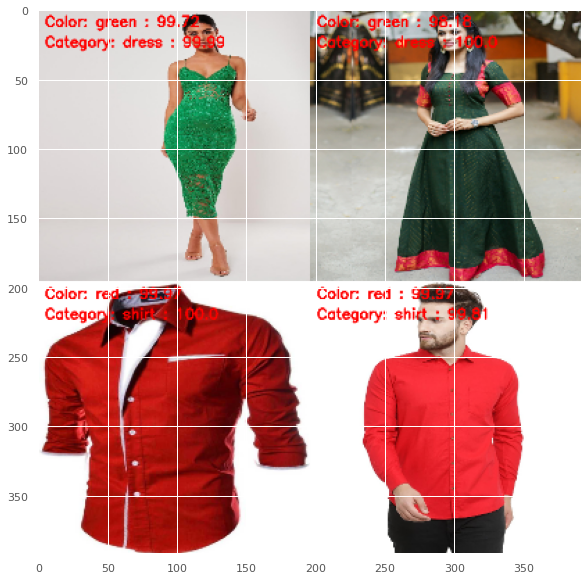

# Fashion-Clothing-Multilabel-Classification

## Overview
A Convolutional Neural Network was designed for multi-label classification of clothing items based on color and category of the clothing using Tensorflow and OpenCV. 
Color based categories: Black,Blue,Red,Green,Brown,White 
Clothing based catgeories: Shirt,Dress,Shoes,Pants,Shorts 

## Dataset
Consisted of 11385 images of multi combinations of clothing category and color. 
Added 6 testing examples of the color-category combinations unseen by the model. 
Kaggle: https://www.kaggle.com/trolukovich/apparel-images-dataset

## Results

Training Accuracy => Clothing : **99.02%** Color: **97.51%** 
Validation Accuracy => Clothing: **93.81%** Color: **96.6%**

## Outputs

